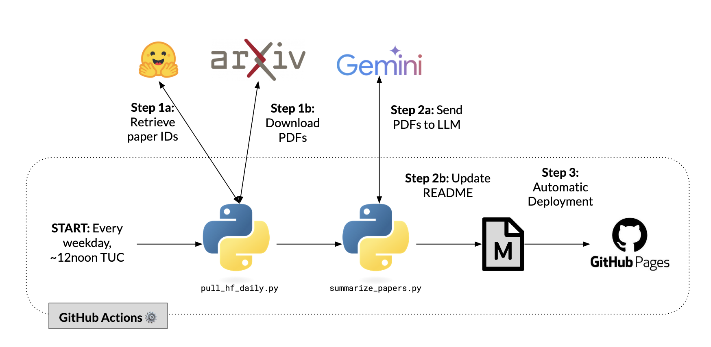

This blog post summarizes a talk I gave at [Machine Learning Singapore](https://www.meetup.com/machine-learning-singapore/). Thank you Martin and Sam for having me!

# Key Points

The summaries are automatically generated from [HuggingFace’s Daily Papers](https://huggingface.co/papers), using Gemini and GitHub actions. All credits go to the research community for sharing and the HuggingFace community for curating these papers.

The GitHub Actions workflow runs two Python scripts, `pull_hf_daily.py` and `summarize_papers.py` - both of which were written using Cursor/Sonnet 3.5.

This entire project runs for free - from the GitHub Actions runners to the LLM calls for Gemini. I initially started with Flash, but realised the generous rate limits would support Pro, and decided to upgrade. Now, each day around noon UTC, the scripts automatically retrieve the latest research papers, generate summaries using a large language model, and push the updates directly to GitHub Pages.

Here is the GitHub Repo: [daily-ai-papers](https://github.com/gabrielchua/daily-ai-papers).

# Slides

 

