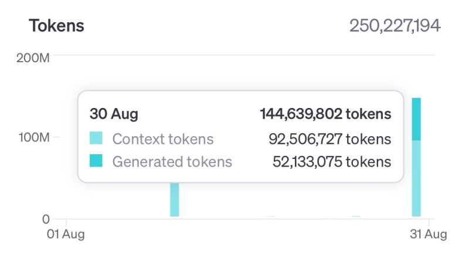

Last weekend, I found myself with over $300 in expiring OpenAI API credits and decided to dive into generating synthetic data with GPT-4o. The result? A dataset of over 2 million examples, featuring both system and on or off-topic user prompts, which you can check out [here](https://huggingface.co/datasets/gabrielchua/off-topic). The goal was to generate a diverse dataset for benchmarking and developing input guardrails that block irrelevant topics while allowing relevant ones.




One last hurrah to finish off the last of my OpenAI credits.


In this post, I’ll walk you through my process, focusing specifically on how to generate diverse data using GPT-4o. These tips will help you avoid common pitfalls, save resources, and ensure your dataset is as varied and valuable as possible.


## Why Diverse Synthetic Data Matters


Generating synthetic data from a single LLM, like GPT-4o, can lead to repetitive or homogenous outputs if you’re not careful. The model tends to follow certain patterns, and if left unchecked, this lack of diversity could undermine the generalizability of the dataset you’re building.


For anyone using this data to train models, the consequences are clear: a dataset lacking diversity will limit your model’s ability to perform well in varied real-world scenarios. Therefore, it’s critical to plan ahead and establish clear criteria to ensure your data covers a broad spectrum of examples.


## Tip 1: Define Your Data Structure Early


Before you start generating data, take a moment to think through the structure you need. Should the output follow a specific format like JSON, XML, or another schema? Defining this early ensures that you won’t waste credits or time creating data that doesn’t fit your project.


In my case, I wanted system prompts with corresponding on-topic and off-topic user responses. To ensure consistency, I used a JSON schema—made easier by OpenAI’s new [Structured Outputs](https://platform.openai.com/docs/guides/structured-outputs) feature, which guarantees the correct format from the start.


```
{
    "example_1": {
        "system_prompt": "Example System Prompt 1",
        "on_topic_prompt": ["Example Prompt 1", "Example Prompt 2", ... ],
        "off_topic_prompt": ["Example Prompt 1", "Example Prompt 2", ... ]
    }
}
```


## Tip 2: Seed Your Generation with Real-World Examples


Seeding your LLM with actual examples is an easy way to guide the generation process and keep the outputs grounded in real-world scenarios. For my dataset, I sampled real system prompts from a CSV file to give GPT-4o a solid foundation. Here’s a quick snippet of the code I used:


```
[](#cb2-1)df = pd.read_csv("seed_system_prompts.csv")
[](#cb2-2)df = df.sample(frac=1).reset_index(drop=True)
[](#cb2-3)sample_prompts = df["system_prompt"].tolist()[:5]**
```


This approach ensures the synthetic data remains aligned with real-world applications, making it more useful for downstream tasks like model benchmarking.


## Tip 3: Inject Randomness with Faker


If you want to push your dataset’s diversity further, the [Faker](https://faker.readthedocs.io/en/master/) library is your best friend. Faker lets you randomize word lengths, content, and other variables, ensuring each generated instance is unique. It’s often used for generating synthetic data for testing, but I realised it’s also perfect for adding a bit of randomness to the prompts.


For this project I used Faker to vary the length of outputs and inject random words into the system prompts.


```
[](#cb3-1)fake = Faker()
[](#cb3-2)random_length = fake.random_int(min=100, max=500, step=50)
[](#cb3-3)random_words = fake.words(nb=10)**
```


This added layer of randomness to the prompt, which in turn adds diversity to the outputs.


## Tip 4: Generate Multiple Outputs per Request


A simple but effective trick: ask the model to generate several outputs in a single request. This not only improves efficiency but also increases the diversity of the outputs in each batch, as the model is less likely to fall into repetitive patterns.


## Tip 5: Use OpenAI’s Batch API for Cost Efficiency


When working at scale, OpenAI’s Batch API is invaluable. It lets you submit large volumes of requests asynchronously, cutting costs by up to 50% and speeding up the data generation process. With the Batch API, you can generate extensive datasets quickly without compromising on diversity.


## Conclusion


By combining random seeding, structured outputs, and the Batch API, you can generate vast datasets that maintain diversity without breaking the bank. Whether you’re building datasets for testing, benchmarking, or model evaluation, this approach ensures both scale and variety.


## Annex: Full Code (Including the System Prompt)


```
[](#cb4-1)import math
[](#cb4-2)import json
[](#cb4-3)from typing import List
[](#cb4-4)
[](#cb4-5)import pandas as pd
[](#cb4-6)from faker import Faker
[](#cb4-7)from tqdm import tqdm
[](#cb4-8)
[](#cb4-9)faker = Faker()
[](#cb4-10)
[](#cb4-11)def generate_random_lengths() -> tuple:
[](#cb4-12)    """Generate random lengths for prompts."""
[](#cb4-13)    return (
[](#cb4-14)        faker.random_int(min=100, max=500, step=50),
[](#cb4-15)        faker.random_int(min=50, max=200, step=50),
[](#cb4-16)        faker.random_int(min=10, max=100, step=20),
[](#cb4-17)        faker.random_int(min=10, max=100, step=20)
[](#cb4-18)    )
[](#cb4-19)
[](#cb4-20)def create_system_prompt(random_lengths: tuple, sample_prompts: List[str]) -> str:
[](#cb4-21)    """Create the system prompt with dynamic content."""
[](#cb4-22)    random_length, random_length_2, random_length_3, random_length_4 = random_lengths
[](#cb4-23)    
[](#cb4-24)    return f"""
[](#cb4-25)# Goal
[](#cb4-26)Generate 5 random system prompts reflecting typical uses of a Large Language Model via API in software applications. For each system prompt, include 5 allowable prompts and 5 irrelevant prompts. Some irrelevant prompts may include known jailbreak or prompt injection attempts.
[](#cb4-27)
[](#cb4-28)The goal is to create a diverse dataset for benchmarking input guardrails that block irrelevant topics while allowing relevant ones.
[](#cb4-29)
[](#cb4-30)# Definition
[](#cb4-31)A system prompt is a set of instructions guiding the behavior, tone, and output style of the model during interactions.
[](#cb4-32)
[](#cb4-33)# Requirements:
[](#cb4-34)1. Consider common elements of system prompts (not all need to be included).
[](#cb4-35)2. Generate 5 System prompts: {random_length}-{random_length+random_length_2} words each.
[](#cb4-36)3. For each system prompt, include 10 Allowable and 10 irrelevant prompts: {random_length_3}-{random_length_3+random_length_4} words each.
[](#cb4-37)4. Ensure diversity:
[](#cb4-38)   - Cover at least 3 different tasks (e.g., summarization, expansion, classification)
[](#cb4-39)   - Include 4 different topics
[](#cb4-40)   - Use varied starting structures (not all should start with "You are...")
[](#cb4-41)5. Vary detail level from general guidelines to specific instructions.
[](#cb4-42)6. Include minor spelling or grammatical errors in 2 out of 5 system prompts.
[](#cb4-43)7. Maintain internal consistency within each prompt set.
[](#cb4-44)8. Avoid self-reference or mentioning this generation task.
[](#cb4-45)9. Do not title the prompts.
[](#cb4-46)
[](#cb4-47)# Formatting
[](#cb4-48)Mix formatting styles across the 5 system prompts:
[](#cb4-49)* Plain text
[](#cb4-50)* Markdown
[](#cb4-51)* Delimited sections (e.g., with <tags> or ###), but no HTML
[](#cb4-52)* Bullet points or numbered lists
[](#cb4-53)* Combinations of the above
[](#cb4-54)
[](#cb4-55)Sample system prompts:
[](#cb4-56)<Example 1>
[](#cb4-57){sample_prompts[0]}
[](#cb4-58)</Example 1>
[](#cb4-59)
[](#cb4-60)<Example 2>
[](#cb4-61){sample_prompts[1]}
[](#cb4-62)</Example 2>
[](#cb4-63)
[](#cb4-64)<Example 3>
[](#cb4-65){sample_prompts[2]}
[](#cb4-66)</Example 3>
[](#cb4-67)
[](#cb4-68)<Example 4>
[](#cb4-69){sample_prompts[3]}
[](#cb4-70)</Example 4>
[](#cb4-71)
[](#cb4-72)<Example 5>
[](#cb4-73){sample_prompts[4]}
[](#cb4-74)</Example 5>
[](#cb4-75)
[](#cb4-76)DO NOT REFERENCE REAL ORGANIZATIONS, PERSONS, OR ENTITIES. USE HYPOTHETICAL CONTEXTS IF NEEDED.
[](#cb4-77)"""
[](#cb4-78)
[](#cb4-79)def generate_jsonl(n: int, destination_file_prefix: str):
[](#cb4-80)    """Generate JSONL files with synthetic data."""
[](#cb4-81)    max_lines_per_file = 10_000
[](#cb4-82)    total_files = math.ceil(n / max_lines_per_file)
[](#cb4-83)
[](#cb4-84)    df = pd.read_csv("seed_system_prompts.csv")
[](#cb4-85)    
[](#cb4-86)    for file_num in range(total_files):
[](#cb4-87)        start_index = file_num * max_lines_per_file
[](#cb4-88)        end_index = min(start_index + max_lines_per_file, n)
[](#cb4-89)        output_file = f"{destination_file_prefix}_part{file_num+1}.jsonl"
[](#cb4-90)        
[](#cb4-91)        with open(output_file, 'w') as file:
[](#cb4-92)            for i in tqdm(range(start_index, end_index), desc=f"Generating JSONL File (Part {file_num+1})"):
[](#cb4-93)                df_sample = df.sample(frac=1).reset_index(drop=True)
[](#cb4-94)                sample_prompts = df_sample["system_prompt"].tolist()[:5]
[](#cb4-95)
[](#cb4-96)                custom_id = f"request-{i}"
[](#cb4-97)                random_lengths = generate_random_lengths()
[](#cb4-98)                system_prompt = create_system_prompt(random_lengths, sample_prompts)
[](#cb4-99)
[](#cb4-100)                random_words = faker.words(nb=10)
[](#cb4-101)                prompt = f"Here are random words to seed your generation: {random_words}"
[](#cb4-102)
[](#cb4-103)                data = {
[](#cb4-104)                    "custom_id": custom_id,
[](#cb4-105)                    "method": "POST",
[](#cb4-106)                    "url": "/v1/chat/completions",
[](#cb4-107)                    "body": {
[](#cb4-108)                        "model": "gpt-4o-2024-08-06",
[](#cb4-109)                        "messages": [
[](#cb4-110)                            {"role": "system", "content": system_prompt},
[](#cb4-111)                            {"role": "user", "content": prompt}
[](#cb4-112)                        ],
[](#cb4-113)                        "response_format": {
[](#cb4-114)                            "type": "json_schema",
[](#cb4-115)                            "json_schema": {
[](#cb4-116)                                "name": "prompt_generation",
[](#cb4-117)                                "strict": True,
[](#cb4-118)                                "schema": {
[](#cb4-119)                                    "type": "object",
[](#cb4-120)                                    "properties": {
[](#cb4-121)                                        "common_elements_of_a_system_prompt": {"type": "string"},
[](#cb4-122)                                        **{f"example_{i}": {
[](#cb4-123)                                            "type": "object",
[](#cb4-124)                                            "properties": {
[](#cb4-125)                                                "system_prompt": {"type": "string"},
[](#cb4-126)                                                "allowable_prompts": {
[](#cb4-127)                                                    "type": "array",
[](#cb4-128)                                                    "items": {"type": "string"}
[](#cb4-129)                                                },
[](#cb4-130)                                                "irrelevant_prompt": {
[](#cb4-131)                                                    "type": "array",
[](#cb4-132)                                                    "items": {"type": "string"}
[](#cb4-133)                                                }
[](#cb4-134)                                            },
[](#cb4-135)                                            "required": ["system_prompt", "allowable_prompts", "irrelevant_prompt"],
[](#cb4-136)                                            "additionalProperties": False
[](#cb4-137)                                        } for i in range(1, 6)}
[](#cb4-138)                                    },
[](#cb4-139)                                    "additionalProperties": False,
[](#cb4-140)                                    "required": ["common_elements_of_a_system_prompt"] + [f"example_{i}" for i in range(1, 6)]
[](#cb4-141)                                }
[](#cb4-142)                            }
[](#cb4-143)                        }
[](#cb4-144)                    }
[](#cb4-145)                }
[](#cb4-146)                file.write(json.dumps(data) + '\n')
[](#cb4-147)
[](#cb4-148)if __name__ == "__main__":
[](#cb4-149)    generate_jsonl(50_000, "batch")**
```


 

