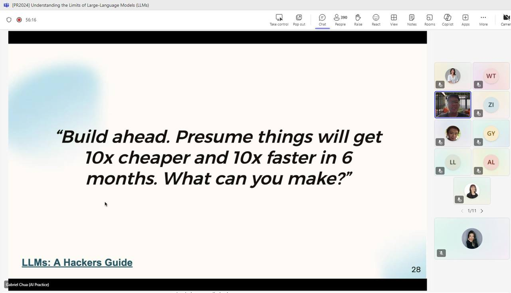

This blog post summarizes an online talk I gave for the [Prompt Royale 2024](https://minicolee.medium.com/how-govtech-designed-the-worlds-first-gpt-4-live-tournament-6249cfc8aa97).

# Key Points

- 
Jagged Intelligence: As observed by [Karpathy](https://x.com/karpathy/status/1816531576228053133), large language models (LLMs) display a “jagged intelligence”—they can execute highly impressive tasks while simultaneously struggling with simple, sometimes trivial problems.

- 
The ability of LLMs to process information within absolute context lengths is improving, such as overcoming the “lost in the middle” issue. However, it remains crucial to optimize context usage by focusing on one call or chat per task, rather than overwhelming the model with excessive context.

- 
The auto-regressive nature of LLMs often contributes to “hallucinations.” Once the model generates an answer, it tends to “force fit” subsequent reasoning to align with that answer. Certain prompting techniques, like chain-of-thought and reflection, can help mitigate these issues, though results may vary.

- 
Are these models genuinely reasoning, or are they merely memorizing a vast array of brain teasers and interpolating from them? This remains a critical area of inquiry.

- 
When it comes to math, the model’s tokenizer plays a significant role. Leveraging external tools, such as the AIMO NuminaMath model, can enhance accuracy.

- 
Ultimately, some limitations of LLMs are deeply tied to their architecture—issues like tokenization and reasoning challenges. However, others, such as context length and reasoning capabilities, may improve as models continue to scale and computing power increases. With models becoming significantly cheaper, faster, and more capable every 6-12 months, it’s important to build with the future in mind. Don’t let the limitations of today’s models constrain your vision—anticipate and prepare for the advancements on the horizon.

# Slides

 

