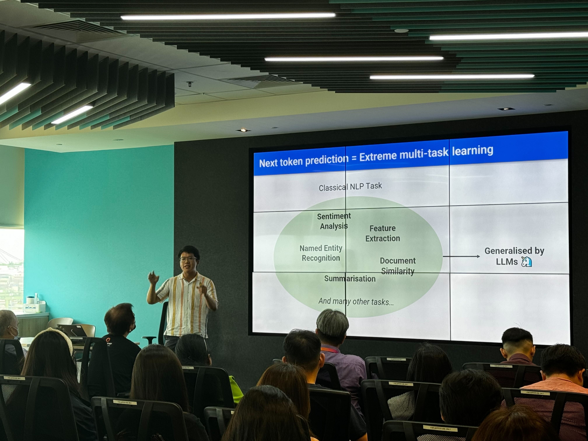

This blog post summarizes a talk I gave at GovTech’s Data Science and AI Connect, a regular gathering of practitioners and enthusiasts across Singapore’s public service. Below are some key points and reflections from my presentation.

# Key Points

- **LLMs as Calculators for Open-Ended Tasks:**

- Instead of viewing LLMs as advanced autocompletes, think of them as calculators for open-ended tasks.

- Just as you’d use a calculator for complex arithmetic, LLMs can handle tasks like extracting last names from a list or classifying restaurant reviews as positive or negative.

- **Understanding the Tokenizer:**

- For technical audiences, I emphasized the importance of understanding the tokenizer and its quirks. As Andrej Karpathy notes, many limitations of LLMs stem from the tokenizer.

- **Developments in Data Analysis:**

- I categorized advancements into LLMs that write code and those that write and execute code. The latter can rewrite code based on results or errors, making them more agentic.

- Text2SQL is popular with models like [Defog.ai](https://huggingface.co/defog) and [Pandas AI](https://github.com/Sinaptik-AI/pandas-ai).

- I demoed ChatGPT’s code interpreter, a feature I believe is underappreciated. While not perfect, it has great potential to empower domain experts and speed up insights and decision-making.

- **LLMs in Classical Machine Learning:**

- LLMs significantly reduce the time needed to deploy an initial prototype. Ship the application quickly and improve it over time with collected data.

- **Practical Tips:**

- Adjust `max_tokens` and `logit_bias` parameters to use LLMs as zero/few-shot classifiers that return confidence scores.

- Use LLMs to generate additional features (columns) and examples (rows).

- Embedding models, though not technically LLMs, can be used out-of-the-box for initial prototypes in text classification tasks.

- **Resources for Getting Started:**

- I concluded with resources on how to begin utilizing LLMs (Slides 23 to 26).

# Slides

 

