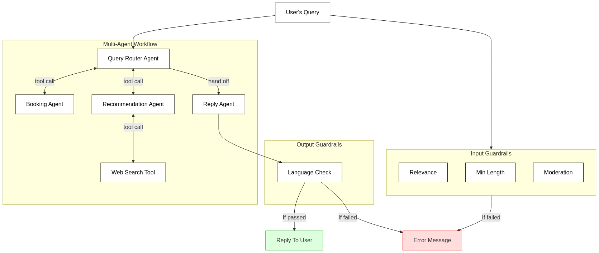
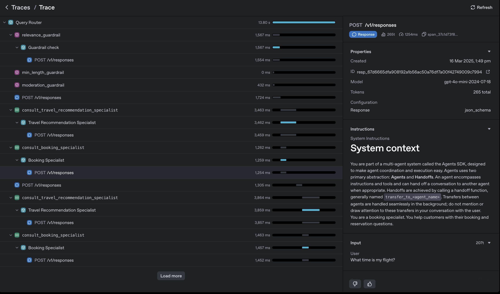

# Building with OpenAI’s Agents SDK: Early Observations 

I spent last weekend exploring OpenAI's newly released [Agents SDK](https://openai.com/api/agents/). To better understand its capabilities, I built a lightweight [prototype](https://github.com/gabrielchua/oai-agents-example) illustrating how multiple LLM-based agents interact, each equipped with input/output validation guardrails.

In this article, I'll highlight my initial impressions, the SDK's standout features, and some caveats to be mindful of if you're considering using it in production.

**TL;DR**: 

- Quick and easy to start.

- OpenAI platform's Traces UI is excellent for debugging, and one less service to manage.

- Input/output guardrails are straightforward but need workarounds for streaming outputs.

- Expect some friction around agent handoffs and potential latency with nested agent calls.

---

## Architecture Overview

Here's the high-level structure of my prototype:



At its core, the workflow includes:

- A central `Query Router Agent` that selects between specialized agents based on the user's input.
- Two specialized agents: a `Booking Agent` for handling reservation queries, and a `Travel Recommendation Agent` providing suggestions and itineraries.
- A final-stage `Reply Agent` adding a friendly, informal touch (including emojis!) to the response.

Throughout this flow, multiple guardrails verify that user inputs are relevant, appropriately sized, and safe. Likewise, outputs are monitored for unintended non-English content.

These guardrails may seem minor, but they're crucial to maintaining quality interactions—and the SDK makes integrating these checks seamless.

---

## Quick Context: What's the Agents SDK?

The [SDK docs](https://openai.github.io/openai-agents-python/tools/) emphasize minimal abstraction:

> *"The OpenAI Agents SDK has a very small set of primitives: Agents, Handoffs, Guardrails. Agents are LLMs with instructions and tools; Handoffs allow agents to delegate; Guardrails validate or transform inputs and outputs."*

## Key Observations

### 1. "Agents as Tools" vs "Handoffs"
- **Handoffs**:
    - Great for sequential tasks and workflows.
    - Pass entire context between agents.
    - Easy to conceptualize linear agent flows.

- **Agents as Tools**:
    - Offer dynamic, conditional orchestration.
    - Allow centralized control of multiple specialized agents.
    - More scalable and extensible.


### 2. The Built-in Traces UI is Outstanding

The SDK includes built-in tracing, significantly simplifying debugging and visibility:



This visualization replaces traditional logs with an intuitive, graphical flow, reducing complexity and eliminating the need for additional tracing infrastructure. Instead of wrestling with mountains of logs, you get a visual map of your entire flow & it's one less service to manage.

### 3. Guardrails and Streaming Outputs: Room for Improvement
Currently:

- **Input guardrails** run concurrently with the initial agent call, promptly halting execution if triggered.
- **Output guardrails**, however, only activate after an agent finishes its entire response.

This limitation means there's no built-in mechanism to interrupt an agent mid-stream if it drifts toward disallowed or problematic content. You'll likely need custom logic if mid-response validation is critical.

### 4. Sometimes Handoffs Don’t Stick
I encountered a hiccup where the `Query Router Agent` wouldn't reliably hand off to the `Booking Agent`. Instead of delegating, it responded with generic text ("Sure, I'll direct you to the booking agent"), failing the intended workflow. Switching from a handoff-based to a tool-based approach immediately resolved this issue.

### 5. Potential Latency Bottlenecks
In one iteration, I initially used the `Reply Agent` as a tool to be called by the `Query Router Agent`. However, I realised this introduced unnecessary latency. Essentially, the router made an extra LLM API call simply to return an already-finalized message to the user. Consider such nested calls carefully to avoid performance issues.

### 6. The `RECOMMENDED_PROMPT_PREFIX` Feels ... Fragile
The SDK suggests a standard prompt prefix, intended for consistency:

> "# System context\nYou are part of a multi-agent system called the Agents SDK, designed to make agent coordination and execution easy. Agents use two primary abstractions: **Agents** and **Handoffs**. An agent encompasses instructions and tools and can hand off a conversation to another agent when appropriate. Handoffs are achieved by calling a handoff function, generally named `transfer_to_<agent_name>`. Transfers between agents are handled seamlessly in the background; do not mention or draw attention to these transfers in your conversation with the user.\n"

While helpful for consistency, forgetting or improperly using this prefix (or even having potentially conflicting instructions) could lead to unpredictable agent behavior. Proceed with caution.

---

## Final Thoughts

At first glance, the Agents SDK may appear as just another thin wrapper around Chat Completions or function calling. But thoughtful features—built-in tracing, easy-to-implement guardrails, and flexible agent orchestration—can meaningfully shape your development approach.

Crucially, abstractions do shape problem-solving and execution. For instance, easy guardrail integration encourages their adoption, boosting system reliability. Moreover, the flexibility between "handoffs" and "tools" enables nuanced orchestration decisions tailored to your specific workflow.

Check out the full [GitHub repo](https://github.com/gabrielchua/oai-agents-example). I'd greatly appreciate your feedback, especially if you've tackled similar challenges around streaming guardrails or have experimented with interesting multi-agent patterns.

In the next section, I'll dive deeper into the actual code behind this prototype.

---

## Annex: Code Deep Dive

Below is the key implementation highlighting agent orchestration and guardrails.

### Primary Agents

Here you can see how we attach the `booking_agent` and `travel_recommendation_agent` to the `query_router_agent` as tools to the main `query_router_agent`, and also allow a handoff to the `reply_agent` for the final response to the user.

```python
booking_agent = Agent(
    name="Booking Specialist",
    model="gpt-4o-mini-2024-07-18",
    instructions=f"{RECOMMENDED_PROMPT_PREFIX} You are a booking specialist. Help customers with reservations and bookings.",
    output_type=MessageOutputWithCoT,
)

travel_recommendation_agent = Agent(
    name="Travel Recommendation Specialist",
    model="gpt-4o-mini-2024-07-18",
    model_settings=ModelSettings(tool_choice='auto'),
    instructions=f"{RECOMMENDED_PROMPT_PREFIX} You're a travel specialist. Suggest destinations and travel itineraries.",
    tools=[WebSearchTool()],
    output_type=MessageOutputWithCoT,
)

reply_agent = Agent(
    name="Reply Agent",
    model="gpt-4o-mini-2024-07-18",
    instructions=f"{RECOMMENDED_PROMPT_PREFIX} Reply informally to the user's query using emojis.",
    output_type=MessageOutput,
    output_guardrails=[non_english_guardrail],
)

query_router_agent = Agent(
    name="Query Router",
    model="gpt-4o-mini-2024-07-18",
    instructions=(
        f"{RECOMMENDED_PROMPT_PREFIX} Decide which agent handles the user's query. "
        "If about bookings, use booking specialist. "
        "If about recommendations, use recommendation specialist. "
        "Always pass responses to the reply agent for emoji formatting."
    ),
    tools=[
        booking_agent.as_tool(
            tool_name="consult_booking_specialist",
            tool_description="Use for booking and reservation inquiries."
        ),
        travel_recommendation_agent.as_tool(
            tool_name="consult_travel_recommendation_specialist",
            tool_description="Use for travel recommendations and itineraries."
        )
    ],
    output_type=MessageOutput,
    handoffs=[reply_agent],
    input_guardrails=[relevance_guardrail, min_length_guardrail, moderation_guardrail],
)
```

### Guardrails

We also attach the `relevance_guardrail` and `non_english_guardrail` to the `query_router_agent` as input guardrails, and the `non_english_guardrail` to the `reply_agent` as an output guardrail.

In fact, the SDK also terms these guardrails as "agents" when you use an LLM API call too.

```python
input_guardrail_agent = Agent( 
    name="Guardrail check",
    model="gpt-4o-mini-2024-07-18",
    instructions="Check if the user is asking you something that is not related to travelling.",
    output_type=RelevanceInputGuardrailOutput,
)

output_guardrail_agent = Agent( 
    name="Guardrail check",
    model="gpt-4o-mini-2024-07-18",
    instructions="Check if the output contains any non-English content.",
    output_type=OutputGuardrailOutput,
)

@input_guardrail
async def relevance_guardrail( 
    ctx: RunContextWrapper[None], agent: Agent, input: str | list[TResponseInputItem]
) -> GuardrailFunctionOutput:
    result = await Runner.run(input_guardrail_agent, input, context=ctx.context)
    return GuardrailFunctionOutput(
        output_info=result.final_output, 
        tripwire_triggered=result.final_output.is_irrelevant,
    )

@output_guardrail
async def non_english_guardrail(  
    ctx: RunContextWrapper, agent: Agent, output: MessageOutput
) -> GuardrailFunctionOutput:
    result = await Runner.run(output_guardrail_agent, output.response, context=ctx.context)
    return GuardrailFunctionOutput(
        output_info=result.final_output,
        tripwire_triggered=result.final_output.is_non_english,
    )
```

But, we don't necessarily need to use an LLM to implement guardrails. We can also use simple heuristics/python functions. Here we leverage OpenAI's moderation API to check if the user's input is flagged, and also a simple python function to check if the input is too short.

```python
@input_guardrail
async def min_length_guardrail( 
    ctx: RunContextWrapper[None], agent: Agent, input: str | list[TResponseInputItem]
) -> GuardrailFunctionOutput:
    user_messages = [message['content'] for message in input if message['role'] == 'user']
    latest_user_message = user_messages[-1]
    input_length = len(latest_user_message)
    if input_length < 10:
        return GuardrailFunctionOutput(
            output_info=MinLengthInputGuardrailOutput(is_too_short=True, error_message="Input is too short"),
            tripwire_triggered=True,
        )
    return GuardrailFunctionOutput(
        output_info=MinLengthInputGuardrailOutput(is_too_short=False, error_message="Input is long enough"), 
        tripwire_triggered=False
    )


@input_guardrail
async def moderation_guardrail(
    ctx: RunContextWrapper[None], agent: Agent, input: str | list[TResponseInputItem]
) -> GuardrailFunctionOutput:
    user_messages = [message['content'] for message in input if message['role'] == 'user']
    latest_user_message = user_messages[-1]
    response = await client.moderations.create(
        model="omni-moderation-2024-09-26",
        input=latest_user_message,
    )
    flagged = response.results[0].flagged

    if flagged:
        return GuardrailFunctionOutput(
            output_info=ModerationInputGuardrailOutput(is_flagged=flagged, error_message="Input is flagged"),
            tripwire_triggered=flagged,
        )
    return GuardrailFunctionOutput(
        output_info=ModerationInputGuardrailOutput(is_flagged=flagged, error_message="Input is not flagged"), 
        tripwire_triggered=flagged
    )
```

### Streaming

Lastly, as these become long running processes, we can stream the various LLM API calls. However, it seems that when using the `agents as tools` approach, we can't stream the second LLM API call.

```python        
result = Runner.run_streamed(
    starting_agent=query_router_agent, 
    input=question,
    run_config=RunConfig(
        workflow_name=WORKFLOW_NAME,
        group_id=GROUP_ID,
        trace_metadata={"user_id": USER_ID},
    ),
)
        
async for event in result.stream_events():
    pass
    if event.type == "raw_response_event":
        event_data = event.data
        if isinstance(event_data, ResponseCreatedEvent):
            agent_name = result.last_agent.name
            print(f"🏃 Starting `{agent_name}`")
            print("-" * 50)
        elif isinstance(event_data, ResponseInProgressEvent):
            print("⏳ Agent response in progress...")
        elif isinstance(event_data, ResponseOutputItemAddedEvent):
            event_data_item = event_data.item
            if isinstance(event_data_item, ResponseFunctionToolCall):
                print(f"🔧 Tool called: {event_data_item.name}")
                print("\t Arguments: ", end="")
            elif isinstance(event_data_item, ResponseOutputMessage):
                print("📝 Drafting response...")
        elif isinstance(event_data, ResponseFunctionCallArgumentsDeltaEvent):
            event_data_delta = event_data.delta
            print(event_data_delta, end="", flush=True)
        elif isinstance(event_data, ResponseFunctionCallArgumentsDoneEvent):
            print("\n✅ Tool call completed!")
        elif isinstance(event_data, ResponseTextDeltaEvent):
            print(event_data.delta, end="", flush=True)
    elif event.type == "run_item_stream_event":
        if event.name == "tool_output":
            print("🛠️ Tool output:")
            print("-" * 40)
            print(event.item.output)
            print("-" * 40)
```
